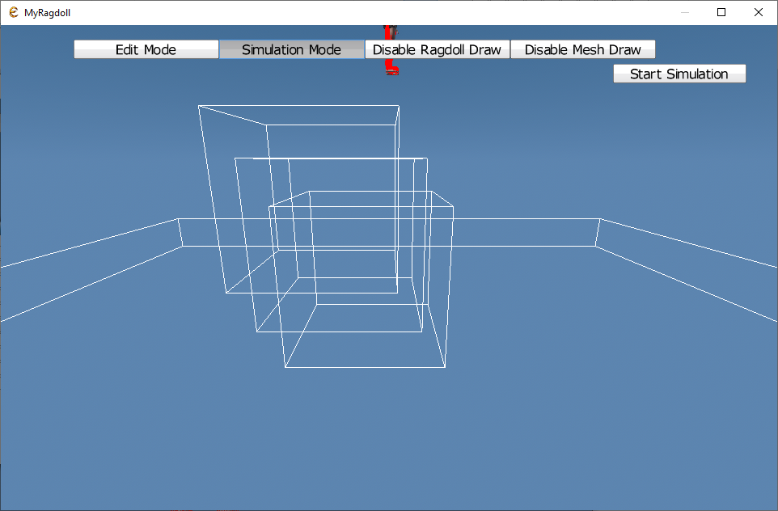
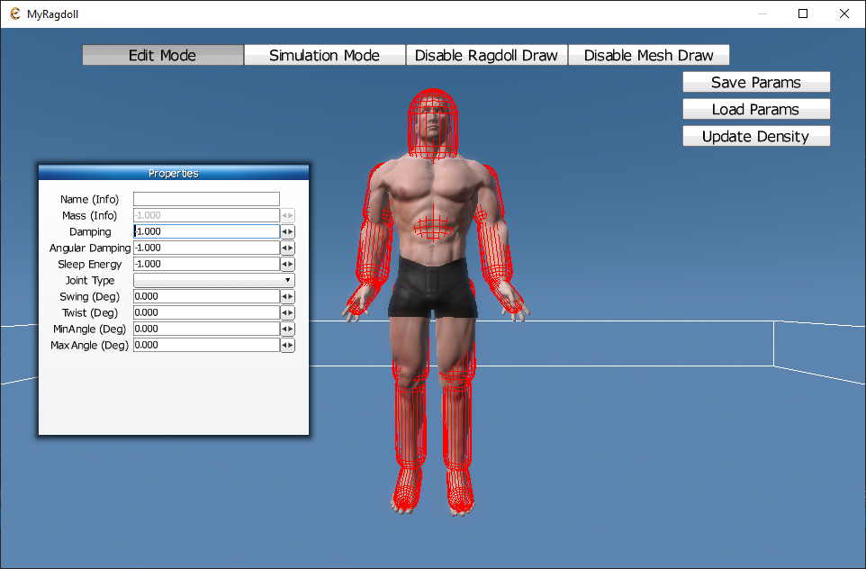

## General info
Ragdoll edytor based on build in Esenthel Engine classes Ragdoll and Chr.
## Technologies
* [Esenthel Engine](http://www.esenthel.com)
* Microsoft Visual Studio
* C++

## Getting Started
* Copy ESENTHEL_ENGINE_INSTALL_PATH\Bin\Esenthel.pak to REPOSITORY_PATH\Bin
* Open Project.sln and update all paths to point to Esenthel engine installation directory.
* Open stdafx.h and update path to where Esenthel engine is installed.
Change ESENTHEL_ENGINE_INSTALL_PATH to path where engine is installed.
* Open project properties. Go to Linker->Input->Additional Dependencies and
change ESENTHEL_ENGINE_INSTALL_PATH to path where engine is installed (You can also open Project.vcxproj in text editor and replace ESENTHEL_ENGINE_INSTALL_PATH).
* Build, if have some include errors or linker check if previous steps are make correct.
```
Error (active)	E1696	cannot open source file "ESENTHEL_ENGINE_INSTALL_PATH/Bin/EsenthelEngine/_/System/begin.h"

```
```
Error	LNK1104	cannot open file 'ESENTHEL_ENGINE_INSTALL_PATH\Bin\EsenthelEngine64DX11.lib'

```
* Run MyRagdoll.exe
* Project is set for PUBLISH so it use local Engine.pak and Project.pak. If you want to change it got o Auto.cpp and change
```cpp
const bool EE_PUBLISH          =true; // this is set to true when compiling for publishing
```
to
```cpp
const bool EE_PUBLISH          =false; // this is set to true when compiling for publishing
```
And also change path to engine pak and project pak.
```cpp
cchar *C   EE_ENGINE_PATH      =((WINDOWS_NEW || MOBILE || WEB) ? u"Engine.pak"  : EE_PUBLISH ? u"Bin/Engine.pak"  : u"ESENTHEL_ENGINE_INSTALL_PATH/Bin/Engine.pak");
cchar *C   EE_PROJECT_PATH     =((WINDOWS_NEW || MOBILE || WEB) ? u"Project.pak" : EE_PUBLISH ? u"Bin/Project.pak" : u"ESENTHEL_ENGINE_PROJECT_PATH/Game");
```
* If you want to use custom model and have set correct project pak. You must change UID in line in Main.cpp->InitPre:
```cpp
player.create(*ObjectPtr(UID(2919624831, 1261075521, 753053852, 3651670215)));
```

## Usage
Version 1.0.0.
#### All modes:
* ESC - Exit editor
* Left CTRL - Hold to rotate camera with mouse. Hold right mouse button to move camera.
* Mouse scroll - Zoom camera in and out. (Works also with LCTRL)
* Disable Ragdoll Draw: Do not draw ragdoll and all related things.
* Disable mesh draw: Do not draw mesh.
#### Simulation mode:

	Start simulation to start, restart simulation.
	If in simulation mode ragdoll break, go into edit mode save default parameters and load them.
#### Edit mode:

	Left Shift + Left mouse button click: Select ragdoll actor and display parameters in window.
	(IMPORTAND! Change actor or click on viewport to update parameters and deselect active actor!)
	Pink actor: Parent to selected actor to which joint is created.
	Yellow actor: Selected actor.
	Black dot: Joint start pos.
	Green line: Joint.
* Save params: Save ragdoll params to ragdoll_params.txt
* Load params: Load ragdoll params from ragdoll_params.txt and set it into current ragdoll. IMPORTAND! Deselect all actors to enable load button.
### Tips
* If use model with skeleton like warrior disable creation of ragdoll for neck and check how it works.
## ChangeLog
### Version 0.0.2
* Save selected actor and joint settings when switch too simulation mode or params are saved to file.
### Version 1.0.0
* Two modes: simulation and edit
* Examples to use with Esenthel Engine

## Use with Esenthel Editor Code
After saving parameters for your ragdoll you can load it and use in existing project.
### Basic example
For basic example we will use application from Tutorial 11 - Physics/11 - Ragdoll.
* Import text file with ragdoll parameters to your project (Just drag and drop for example to Objects folder).
* Open application 11 - Physics/11 - Ragdoll.
To make it work we need some extra code that can be found in EsenthelProjectSource in repository.
* Create new code with name Helpers and copy code from [EsenthelProjectSource/Helpers.h](EsenthelProjectSource/Helpers.h)
* Create new code with name MyRagdoll and copy code from [EsenthelProjectSource/MyRagdoll.h](EsenthelProjectSource/MyRagdoll.h)
* Create new code with name MyRagdollParams and copy code from [EsenthelProjectSource/MyRagdollParams.h](EsenthelProjectSource/MyRagdollParams.h)
You should now have all needed source code and project must build. If no report bug.
To use new created class we need to make some changes in Main file.
* Change line 
```cpp
Ragdoll ragdoll;
```
to
```cpp
MyRagdoll ragdoll;
```
Now new class is used for ragdoll but it is created with default parameters (Should behave the same as old one!?).
* In Init() search for:
```cpp
ragdoll.create(skel);                      // create ragdoll from skeleton
```
 and change it to
```cpp
Flt densityOut; // Density saved in file or 1000 if not saved.
Mems<RagdollActorData> rad = RagdollDataHelpers::LoadRagdollData(RAGDOLL_PARAMS_FILE_UID, densityOut); // Parameters for all bones and joints
RagdollData rd(densityOut,  rad); // Object with all data to create ragdoll
ragdoll.create(skel, rd,  1.7,  densityOut); // Create ragdoll from loaded data
```
* At last change RAGDOLL_PARAMS_FILE_UID to your file UID, or if want you can load file with name from disc.
* After that the ragdoll will be created with loaded parameters.

### Example with custom player class
For advanced tutorial with custom character we will use 14 - Game Basics/13 - Ragdoll.
* Import text file with ragdoll parameters to your project (Just drag and drop for example to Objects folder).
* Open application 14 - Game Basics/13 - Ragdoll.
To make it work we need some extra code that can be found in EsenthelProjectSource in repository.
* Create new code with name Player and copy code from [EsenthelProjectSource/Player.h](EsenthelProjectSource/Player.h)
* In Player code in RagdollValidate change RAGDOLL_PARAMS_FILE_UID to your file UID, or if want you can load file with name from disc.
* Create new code with name Helpers and copy code from [EsenthelProjectSource/Helpers.h](EsenthelProjectSource/Helpers.h)
* Create new code with name MyRagdoll and copy code from [EsenthelProjectSource/MyRagdoll.h](EsenthelProjectSource/MyRagdoll.h)
* Create new code with name MyRagdollParams and copy code from [EsenthelProjectSource/MyRagdollParams.h](EsenthelProjectSource/MyRagdollParams.h)
You should now have all needed source code and project must build. If no report bug.
To use new created class we need to make some changes in Main file.
* Change line
```cpp
Game.ObjMap<Game.Chr> Chrs;
```
to
```cpp
Game.ObjMap<Player> Chrs;
```
and line
```cpp
Game.Chr &chr=Chrs[0];
```
to
```cpp
Player &chr=Chrs[0];
```
* Then we need to change
```cpp
if(Kb.bp(KB_Q))if(chr.ragdollBlend())if(Ragdoll.Bone *bone=chr.ragdoll.findBone("Head" ))bone.actor.addVel(Vec(0, 0, 3));
if(Kb.bp(KB_W))if(chr.ragdollBlend())if(Ragdoll.Bone *bone=chr.ragdoll.findBone("Body" ))bone.actor.addVel(Vec(0, 0, 3));
if(Kb.bp(KB_E))if(chr.ragdollBlend())if(Ragdoll.Bone *bone=chr.ragdoll.findBone("FootR"))bone.actor.addVel(Vec(0, 0, 4));
if(Kb.bp(KB_R))if(chr.ragdollBlend())if(Ragdoll.Bone *bone=chr.ragdoll.findBone("HandR"))bone.actor.addVel(Vec(0, 0, 4));
```
to
```cpp
if(Kb.bp(KB_Q))if(chr.ragdollBlend())if(MyRagdoll.Bone *bone=chr.ragdoll.findBone("Head" ))bone.actor.addVel(Vec(0, 0, 3));
if(Kb.bp(KB_W))if(chr.ragdollBlend())if(MyRagdoll.Bone *bone=chr.ragdoll.findBone("Body" ))bone.actor.addVel(Vec(0, 0, 3));
if(Kb.bp(KB_E))if(chr.ragdollBlend())if(MyRagdoll.Bone *bone=chr.ragdoll.findBone("FootR"))bone.actor.addVel(Vec(0, 0, 4));
if(Kb.bp(KB_R))if(chr.ragdollBlend())if(MyRagdoll.Bone *bone=chr.ragdoll.findBone("HandR"))bone.actor.addVel(Vec(0, 0, 4));
```
so Ragdoll.Bone must be changed to MyRagdoll.Bone. After that custom player with custom ragdoll will be used.

## Warning!
* If in some case you will use cast to built in Game.Chr new MyRagdoll will be not used as it hides base class Ragdoll ragdoll.
* Some other methods are also not virtual so there are only hide. This can couse errors.
* This was made as alternative to editing source code but because of that it has limitation and couse errors in some cases.
* The best ide will be to find good parameters and update them in engine source code.